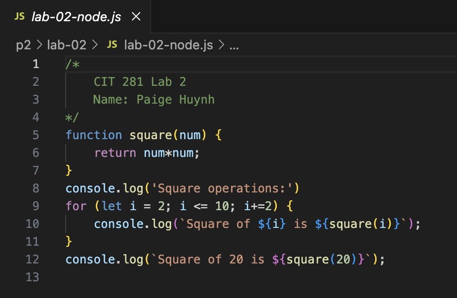
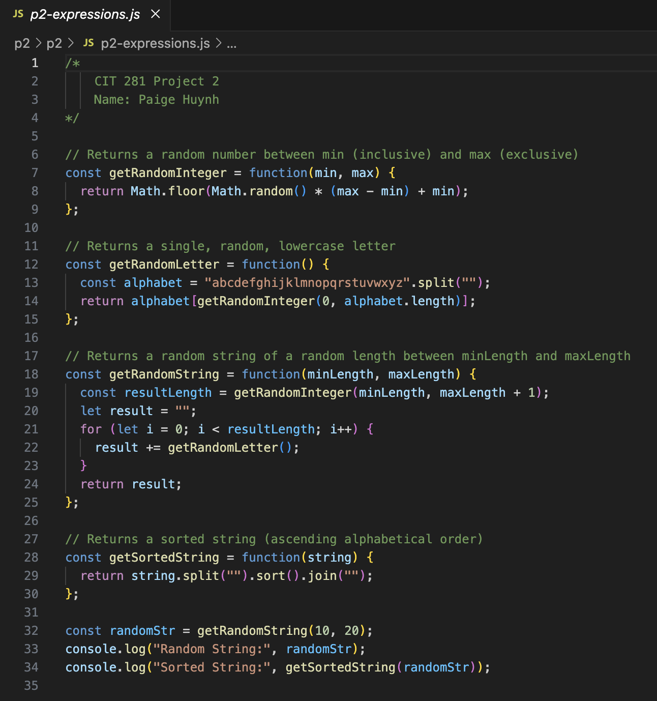

# CIT 281 Project 2

## Lab 2
Purpose: Practice using CLI commands for directory and file manipulation, practice git commands including repository setup, adding files, ignoring files, viewing diffs, branching, and cloning cloud repositories, and use VS Code for git operations.

Technologies: Command Line Interface (CLI), Git, Visual Studio Code (VSCode), JavaScript

Learned: How to configure git user credentials, create and manage git repositories, add and ignore files in git, view file changes with diff, use wildcards in git, clone repositories from the cloud, manage branches, and integrate git workflows within VS Code.

## Project 2
Purpose: Gain experience using git via CLI and VSCode Source Control, gain experience writing and executing non-web server Node.js JavaScript code, and practice JavaScript code refactoring.

Technologies: Git, Node.js, JavaScript, Visual Studio Code (VSCode), Command Line Interface (CLI)

Learned: How to create and work with a git repository using CLI and VSCode, how to refactor JavaScript code, how to create and use a .gitignore file, and how to handle UTF-8 encoding issues in VSCode.

